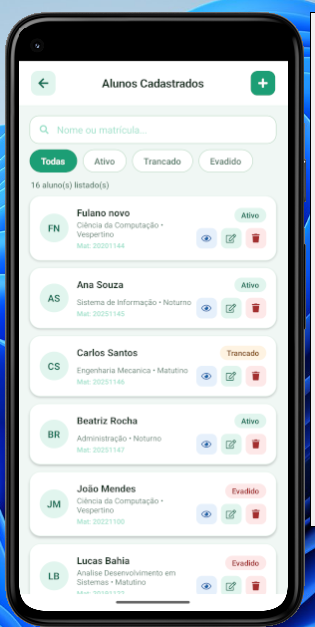
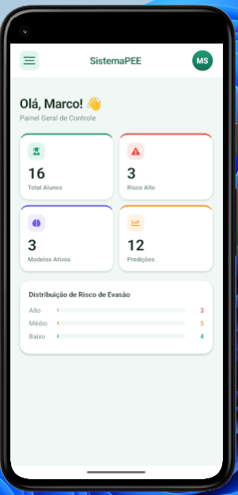

# SistemaPEE - Sistema Preditivo de Evasão Escolar

**Área:** Educação

## Descrição

O **Sistema Preditivo de Evasão Escolar (SistemaPEE)** é uma solução desenvolvida para auxiliar instituições de ensino no acompanhamento do desempenho acadêmico dos alunos e na identificação antecipada de possíveis riscos de evasão escolar.

O sistema permite:

- Cadastrar alunos;
- Registrar o desempenho acadêmico dos alunos;
- Utilizar modelos de **Machine Learning** para realizar previsões de evasão escolar;
- Gerar relatórios que apoiam a tomada de decisões.

## Requisitos Funcionais

-   **RF01:** O sistema deve permitir realizar login com e-mail e senha.
-   **RF02:** O sistema deve permitir cadastrar, consultar, editar e
    excluir alunos.
-   **RF03:** O sistema deve permitir registrar e consultar o desempenho
    acadêmico dos alunos.
-   **RF04:** O sistema deve permitir realizar análise preditiva de
    evasão escolar.
-   **RF05:** O sistema deve permitir selecionar o modelo preditivo
    utilizado na análise.
-   **RF06:** O sistema deve apresentar a probabilidade e o nível de
    risco de evasão do aluno.
-   **RF07:** O sistema deve permitir consultar e exportar relatórios.
-   **RF08:** O sistema deve registrar e consultar os logs de acessos
    dos usuários.

## Requisitos Não Funcionais

-   **RNF01:** O aplicativo deve possuir interface adaptada para
    dispositivos móveis.
-   **RNF02:** O aplicativo deve possuir uma interface simples e
    intuitiva.
-   **RNF03:** O sistema deve garantir autenticação e controle de acesso
    dos usuários.
-   **RNF04:** O sistema deve apresentar tempo de resposta adequado nas
    operações.
-   **RNF05:** Os dados armazenados devem possuir mecanismos de
    segurança e integridade.
-   **RNF06:** O sistema deve manter os registros de acesso para fins de
    auditoria.
-   **RNF07:** O sistema deve permitir manutenção e evolução das
    funcionalidades e modelos preditivos.

## Telas do aplicativo

### 1 - Tela de Login

**Figura 1 -** Tela de login utilizada para autenticação dos usuários,
permitindo o acesso ao sistema por meio de e-mail e senha.

### 2 - Tela do painel

**Figura 2 -** Painel principal do SistemaPEE, apresentando um resumo
das informações do sistema, como quantidade de alunos, alunos em risco,
modelos preditivos ativos e previsões realizadas.

### 3 - Submenu

**Figura 3 -** Submenu de navegação do aplicativo, disponibilizando
acesso às principais funcionalidades, como lista de alunos, realização
de predições, desempenho, relatórios, configuração de modelos e logs de
acesso.

### 4 - Tela Lista dos Alunos

**Figura 4 -** Tela de gerenciamento dos alunos cadastrados, permitindo
consultar os estudantes, visualizar suas informações e acessar opções de
edição e exclusão dos registros.

### 5 - Tela Predição

**Figura 5 -** Tela de análise preditiva de evasão escolar, permitindo
selecionar o aluno e o modelo preditivo para realizar a análise e
apresentar a probabilidade e o nível de risco de evasão.

### 6 - Tela Desempenho

**Figura 6 -** Tela de registro e acompanhamento do desempenho acadêmico
dos alunos, apresentando informações como média, frequência e quantidade
de reprovações, auxiliando na avaliação do desempenho escolar.

### 7 - Tela Relatórios

**Figura 7 -** Tela de relatórios do sistema, permitindo consultar
informações dos alunos e seus indicadores acadêmicos e de risco, além de
possibilitar a exportação dos dados em formatos PDF e Excel.

### 8 - Tela Modelos

**Figura 8 -** Tela de gerenciamento dos modelos preditivos utilizados
pelo sistema, apresentando os algoritmos disponíveis, suas respectivas
acurácias e informações de treinamento.

### 9 - Tela Logs

**Figura 9 -** Tela de logs de acesso, responsável por registrar e
apresentar o histórico das atividades realizadas pelos usuários no
sistema, auxiliando no acompanhamento e na auditoria dos acessos.

## Tecnologias Utilizadas

O SistemaPEE foi desenvolvido utilizando React Native, possibilitando a
criação do aplicativo para dispositivos móveis. Para o desenvolvimento
foram utilizados JavaScript, Expo e Node.js, além de recursos de banco
de dados para armazenamento das informações dos alunos, desempenhos,
predições, modelos e registros de acesso.

## Metodologia de Desenvolvimento

O desenvolvimento do SistemaPEE foi realizado de forma incremental, com
a implementação gradual das funcionalidades do aplicativo. Inicialmente
foram definidas as principais funcionalidades e telas do sistema. Em
seguida, foram desenvolvidos os recursos de cadastro e gerenciamento dos
alunos, acompanhamento do desempenho acadêmico, modelos preditivos,
análise de risco de evasão, relatórios e logs de acesso. Durante o
desenvolvimento, foram realizados testes e ajustes para verificar o
funcionamento das funcionalidades e melhorar a experiência de utilização
do aplicativo.

